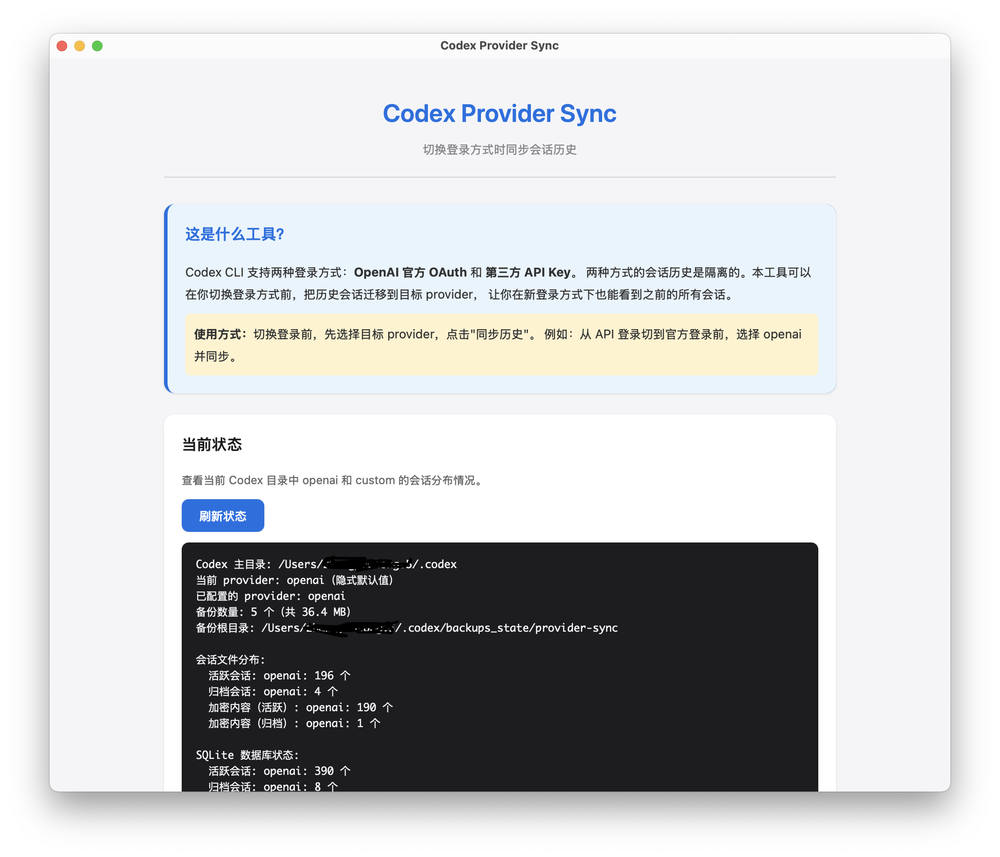
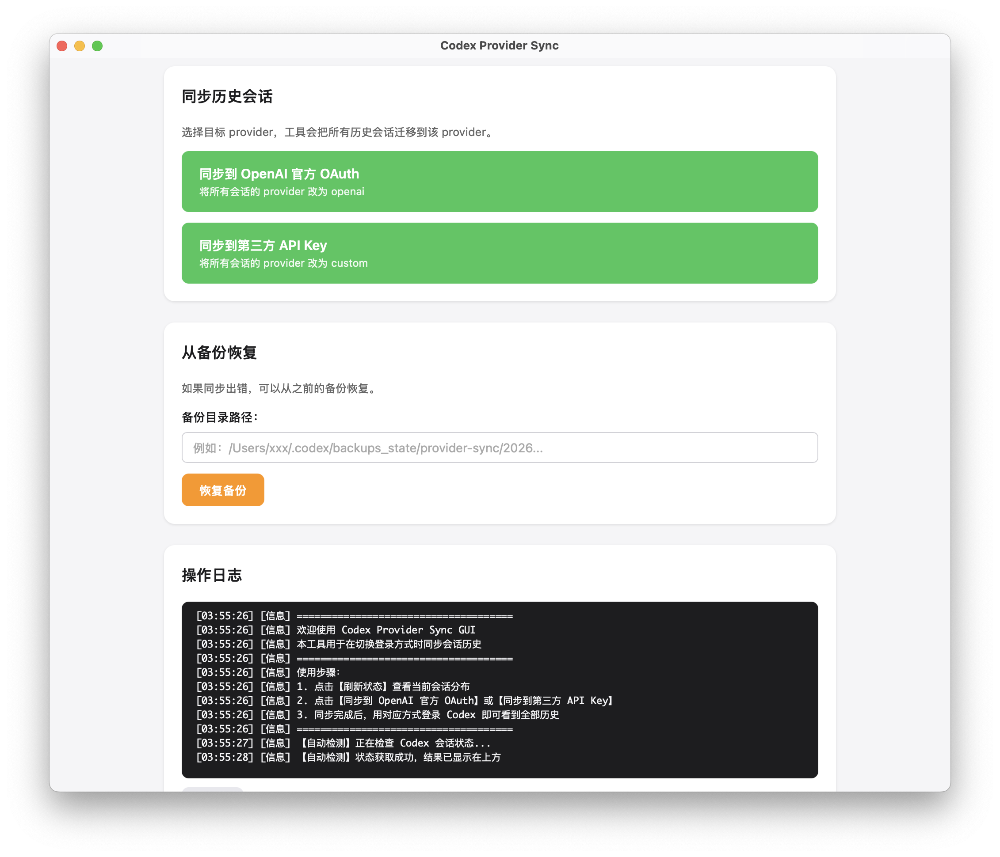

<div align="center">

# 🔄 Codex Provider Sync

**在切换 Provider 之后，让 Codex 的历史会话重新可见**

[](https://github.com/Friday-Up/codex-provider-sync/releases)
[](./LICENSE)
[](https://nodejs.org/)
[](https://tauri.app/)
[](#-安装)
[](https://github.com/Friday-Up/codex-provider-sync/pulls)
[](https://github.com/Friday-Up/codex-provider-sync)

[问题背景](#-解决什么问题) • [界面预览](#-界面预览) • [安装](#-安装) • [快速开始](#-快速开始) • [命令说明](#-命令说明) • [使用场景](#-使用场景) • [常见问题](#-常见问题)

</div>

---

## 💡 解决什么问题

Codex CLI 支持两种登录方式：**OpenAI 官方 OAuth** 和 **第三方 API Key**。两种方式的会话历史**是隔离的**——切换后之前的会话会"消失"。

### 常见现象

- 🔍 `codex resume` 里能看到的会话，到了 Codex App 里不一定还能看到
- 🔄 切回官方 `openai` 后，之前在第三方 provider 下的历史会话像没了
- 🗄️ 只改 `sessions/*.jsonl` 不够，因为 SQLite 里还有一层 provider 元数据

### 本工具的做法

`codex-provider-sync` 会把这两层一起同步：

| 数据层 | 路径 | 内容 |
| --- | --- | --- |
| 📁 **会话文件** | `~/.codex/sessions` 和 `~/.codex/archived_sessions` | 对话原始 JSONL |
| 🗃️ **元数据库** | `~/.codex/state_5.sqlite` | provider 标记、索引、可见性 |

> 一键把所有历史会话挂到当前 Provider 下，让你的 Codex App 真的"看得到"。

---

## ✨ 功能特性

| 特性 | 说明 |
| --- | --- |
| 🖥️ **跨平台 GUI** | macOS（.dmg）+ Windows（.exe / .msi）双平台桌面应用 |
| ⌨️ **CLI 工具** | 完整命令行能力，适合脚本化和自动化场景 |
| 🔁 **双向同步** | 在官方 OAuth ↔ 第三方 API Key 之间任意切换 |
| 💾 **自动备份** | 每次同步前自动备份到独立目录，最多保留 5 份 |
| ↩️ **一键恢复** | 误操作可从任意备份恢复，不丢数据 |
| 🧪 **完整测试** | CLI 端覆盖完整测试用例，行为可预期 |

---

## 🖼️ 界面预览

<div align="center">



*主界面 —— 查看当前状态与 Provider 分布*

<br>



*操作界面 —— 一键同步会话历史与备份恢复*

</div>

---

## 📦 安装

### 方式一：直接下载（推荐）

从 [Releases](https://github.com/Friday-Up/codex-provider-sync/releases) 页面下载最新版本：

| 平台 | 下载 | 安装方式 |
| --- | --- | --- |
| 🍎 **macOS** | `.dmg` | 拖拽至 Applications 即可 |
| 🪟 **Windows** | `.exe` / `.msi` | 双击运行 / 管理员安装 |

### 方式二：CLI 单独安装

```bash
cd codex-provider-sync
npm install
codex-provider status
```

### 方式三：从源码构建 GUI

```bash
cd codex-provider-gui
npm install
npm run tauri build
# 构建产物位于 src-tauri/target/release/bundle/
```

---

## 🚀 快速开始

### 🖱️ GUI 方式（推荐）

1. 打开 `Codex Provider Sync.app`
2. 点击 **刷新状态** 查看当前 Provider 分布
3. 选择目标同步方向：
   - **同步到 OpenAI 官方 OAuth** —— 将所有会话改为 `openai`
   - **同步到第三方 API Key** —— 将所有会话改为 `custom`
4. 查看底部日志确认结果

### ⌨️ CLI 方式

```bash
# 查看当前状态
codex-provider status

# 同步历史会话到当前 provider
codex-provider sync

# 切换到指定 provider 并同步
codex-provider switch openai
```

---

## 📋 命令说明

| 命令 | 说明 |
| --- | --- |
| `codex-provider status` | 显示当前 provider 及分布 |
| `codex-provider sync` | 同步历史会话到当前 provider |
| `codex-provider switch <provider-id>` | 切换 provider 并同步 |
| `codex-provider restore <backup-dir>` | 从备份恢复 |
| `codex-provider prune-backups` | 清理旧备份 |

---

## 🎬 使用场景

<details open>
<summary><b>场景 1：从 API Key 切到官方 OAuth</b></summary>

1. 打开 GUI，点击 **刷新状态**
2. 点击 **同步到 OpenAI 官方 OAuth**
3. 等待完成，日志显示成功
4. 现在可以用官方 OAuth 登录，历史会话都在 ✅
</details>

<details>
<summary><b>场景 2：从官方 OAuth 切到 API Key</b></summary>

1. 打开 GUI，点击 **刷新状态**
2. 点击 **同步到第三方 API Key**
3. 等待完成
4. 切换到 API Key 登录，历史会话都在 ✅
</details>

<details>
<summary><b>场景 3：误操作恢复</b></summary>

1. 在 **从备份恢复** 区域输入备份目录路径
2. 点击 **恢复备份**
3. 数据恢复到同步前的状态 ↩️
</details>

---

## 🛡️ 安全说明

每次同步前，工具都会先**自动备份**到：

```text
~/.codex/backups_state/provider-sync/<timestamp>
```

### ⚠️ 重要注意事项

| 项目 | 说明 |
| --- | --- |
| ✅ **会做** | 同步会话文件 + SQLite 元数据；自动备份；保留消息内容 |
| ❌ **不会做** | 替换官方 `codex` / 处理 `auth.json` / 改第三方切号工具 |
| 🚫 **不会改** | 消息历史、标题、cwd、时间戳 |
| 💾 **备份策略** | 默认自动保留最近 5 份备份 |
| 🔒 **占用提示** | 如果 `state_5.sqlite` 被占用，**先关闭 Codex App** 再重试 |
| 🔐 **加密会话** | 如果历史会话包含 `encrypted_content`，跨 provider 后可能只能恢复可见性 |

---

## 🗂️ 项目结构

```text
codex-provider-sync-project/
├── codex-provider-sync/      # CLI 工具（Node.js）
│   ├── src/                  # 核心源码
│   ├── test/                 # 测试用例
│   ├── README.md             # CLI 详细文档
│   └── package.json
│
├── codex-provider-gui/       # 桌面 GUI（Tauri v2）
│   ├── src/                  # 前端页面
│   ├── src-tauri/            # Rust 后端
│   └── package.json
│
├── screenshots/              # 截图素材
├── LICENSE                   # MIT 协议
└── README.md                 # 本文件
```

---

## ❓ 常见问题

<details>
<summary><b>Q1：同步后 Codex App 里还是看不到会话？</b></summary>

请确保**同步前已关闭 Codex App**，同步完成后再重新打开。SQLite 文件被占用时，元数据更新可能未生效。
</details>

<details>
<summary><b>Q2：可以恢复之前的备份吗？</b></summary>

可以。使用 GUI 的 **从备份恢复** 功能，或运行：
```bash
codex-provider restore <备份路径>
```
默认备份路径在 `~/.codex/backups_state/provider-sync/`。
</details>

<details>
<summary><b>Q3：支持 Windows 吗？</b></summary>

支持。CLI 工具跨平台可用，GUI 提供 macOS（`.dmg`）和 Windows（`.msi` / `.exe`）两种安装包。
</details>

<details>
<summary><b>Q4：会修改我的 OpenAI 官方账号数据吗？</b></summary>

不会。本工具只操作本地 `~/.codex/` 目录下的文件，不会上传任何数据，也不会调用 OpenAI 官方 API。
</details>

<details>
<summary><b>Q5：备份会无限增长吗？</b></summary>

不会。默认保留最近 5 份备份，旧备份会通过 `prune-backups` 命令自动清理。
</details>

---

## 🛠️ 开发

```bash
# 克隆仓库
git clone https://github.com/Friday-Up/codex-provider-sync.git
cd codex-provider-sync

# 运行 CLI 测试
cd codex-provider-sync
npm install
npm test

# 启动 GUI 开发模式
cd ../codex-provider-gui
npm install
npm run tauri dev
```

---

## 🤝 贡献

欢迎任何形式的贡献！

1. Fork 本仓库
2. 创建特性分支：`git checkout -b feature/amazing-feature`
3. 提交变更：`git commit -m 'feat: add amazing feature'`
4. 推送分支：`git push origin feature/amazing-feature`
5. 提交 Pull Request

提交信息请遵循 [Conventional Commits](https://www.conventionalcommits.org/) 规范。

---

## 📜 License

本项目基于 [MIT License](./LICENSE) 开源协议发布。

---

## 🌟 致谢

- [Codex CLI](https://github.com/openai/codex) —— OpenAI 官方编码助手
- [Tauri](https://tauri.app/) —— 轻量跨平台桌面应用框架
- 所有提交 Issue 和 PR 的贡献者 ❤️

## 📦 发布日志

详见 [Releases](https://github.com/Friday-Up/codex-provider-sync/releases) 页面。

---

<div align="center">

由 [Friday Up](https://github.com/Friday-Up) 维护

**如果这个工具帮到了你，欢迎点一个 ⭐ Star 支持一下！**

</div>